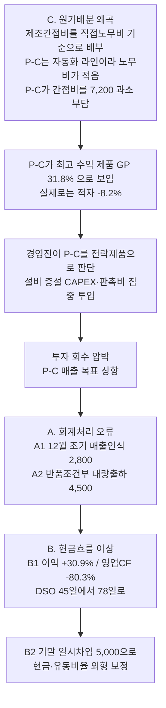

# 정답지 (Answer Key)

`data/generate.py`가 의도적으로 심어둔 이상징후의 전체 목록. **에이전트에게는 절대 주지 않는다.** 에이전트가 몇 개를 스스로 찾아냈는지 채점하는 데만 쓴다.

아래 수치는 모두 생성된 데이터에서 재검증한 값이다 (단위: 백만원).

---

## 인과 사슬

세 종류의 문제는 독립적으로 흩어져 있지 않다. **P-C(EV 구동부품) 라인의 원가 왜곡이 출발점**이고, 나머지는 그 결과다.

한 줄 요약: **"실제로는 적자인 제품을 흑자로 착각해 자원을 쏟아붓고 있고, 그 실적을 맞추려 매출을 당겨 인식한 결과 현금이 마르고 있으며, 그것을 기말 일시차입으로 가리고 있다."**

---

## A. 회계처리 오류

### A1 · 기간귀속 오류 (매출 조기인식) — 난이도 中
| 항목 | 내용 |
|---|---|
| 규모 | **2,800** (9건) |
| 단서 | `sales_invoices.csv`의 `revenue_date`는 2024-12-27~31, `shipments.csv`의 `actual_ship_date`는 2025-01-02~07 |
| 결정적 근거 | `incoterms`가 **FOB 도착지** → 통제 이전 시점은 도착일. 기말 이전 매출인식 요건 미충족 |
| 왜 어려운가 | GL(`gl_journal.csv`)만 보면 정상 전표. **판매 시스템과 물류 시스템을 조인해야** 드러난다 |
| 영향 | FY2024 매출 2,800 과대, 매출채권 2,800 과대 |
| 해당 전표 | `SI2024-00604`, `00607`, `00611` 등 9건 |

### A2 · 반품조건부 판매의 총액 인식 — 난이도 上
| 항목 | 내용 |
|---|---|
| 규모 | 12월 출하 **4,500** → 익년 1~2월 반품 **3,100** |
| 대상 | 대리점 3곳: 우성모터스(C801), 삼정오토파츠(C802), 정한상사(C803) |
| 단서 1 | 대리점 반품률 **68.9%** vs 정상 거래처 **3.0%** |
| 단서 2 | `master_customers.csv`의 `contract_type`이 **"위탁성"** |
| 단서 3 | `ar_aging.csv`에서 대리점 채권 전액이 `days_0_30`에 몰려 있고 회수 실적 없음 |
| 단서 4 | `related_parties.csv` — 우성모터스는 **대표이사 배우자가 지분 60% 보유** |
| 왜 어려운가 | 반품은 **2025년에 발생하므로 FY2024 GL에 아예 없다.** 기간을 넘어가는 `credit_notes.csv`를 봐야 한다 |
| 영향 | FY2024 매출 3,100 과대 (실질은 위탁판매 → 반품 시점까지 수익 인식 불가) |

### A3 · 자본적지출을 수선비로 비용처리 — 난이도 下
| 항목 | 내용 |
|---|---|
| 규모 | **1,450** (4건), 계정 `614 수선비(제조)` |
| 단서 | `purchase_orders.csv`의 `item_description`이 "금형 신규 제작", "프레스 설비 증설", "자동화 로봇 추가 도입", "라인 레이아웃 변경 공사" |
| 보조 단서 | 같은 파일 `remark`에 "내용연수 5년 이상 / 취득 후 생산능력 증가 예상" |
| 해당 전표 | `PO2024-00147`(620), `00148`(480), `00149`(220), `00150`(130) |
| 영향 | 비용 1,450 과대, 유형자산 과소 (A1·A2와 **반대 방향** — 단순 이익조정으로 뭉뚱그리면 틀린 해석) |
| 숨은 연결 | 4건 모두 **P-C 라인** 관련이다. 그런데 수선비는 공통 제조간접비 풀에 들어가 직접노무비 기준으로 배부되므로, **P-C가 쓴 돈의 60%가 P-A에 전가된다.** C의 왜곡을 더 키우는 경로 |

---

## B. 현금흐름

### B1 · 이익과 영업현금흐름의 괴리 — 난이도 中
| 지표 | FY2023 | FY2024 | 변화 |
|---|---|---|---|
| 영업이익 | 6,800 | 8,900 | **+30.9%** |
| 영업활동현금흐름 | 6,100 | 1,200 | **-80.3%** |
| 매출채권 | 9,400 | 18,800 | +9,400 |
| DSO | 45일 | **78일** | +33일 |

- 이익은 늘었는데 현금은 말랐다. 매출채권이 매출 증가율(15.8%)의 **4배 넘게(100%)** 늘었다.
- A1(2,800) + A2(3,100) = **5,900이 회수되지 않을 채권**으로 남아 있다. 즉 B1은 A의 결과다.
- 재무활동현금흐름이 -600 → **+8,500**으로 전환 = 영업에서 못 번 돈을 차입으로 메우고 있다.

### B2 · 기말 일시차입에 의한 외형 보정 — 난이도 上
| 일자 | 내용 | 금액 |
|---|---|---|
| 2023-12-28 | 단기차입 (기업은행) | +3,000 |
| 2024-01-04 | 상환 | -3,000 |
| 2024-12-27 | 단기차입 (기업은행, **만기 2025-01-05**) | +5,000 |
| 2025-01-05 | 상환 | -5,000 |

- 기말 현금 6,800 중 5,000이 일시차입 → **실질 현금은 1,800**
- **2년 연속 동일 패턴**이므로 우연이 아니라 관행이다. 이 반복성이 결정적 증거다.
- `bank_transactions.csv`의 `description`에 만기일이 그대로 적혀 있다. 재무상태표만 보면 절대 보이지 않는다.

### B3 · 특수관계자 자금 유출의 계정 오분류 — 난이도 中
| 항목 | 내용 |
|---|---|
| 규모 | 월 **200** × 12회 = **2,400** |
| 상대방 | (주)한빛홀딩스 — `related_parties.csv`상 **최대주주(대표이사 지분 78%)** |
| 계상 계정 | `115 미수금` (실질은 **대여금**) |
| 문제 3개 | ① 계정 오분류 ② **이자수익 계상 전무** (무상 대여) ③ 특수관계자 거래 주석 공시 대상 |
| 단서 | `미수금` 잔액이 310 → **2,710** (8.7배). `bank_transactions.csv` 적요는 "운영자금 대체 (한빛홀딩스)"로 모호 |
| 보조 단서 | 12건 모두 **입력자 김민서 / 승인자 오세훈(관리본부장)** 로 고정 — 통상 전표는 담당자가 분산됨 |

---

## C. 원가배분 왜곡 (핵심)

### C1 · 배부기준 부적합으로 인한 수익성 역전 — 난이도 上

제조간접비 **15,000**을 **직접노무비** 기준 단일 배부율로 배부하고 있다. 그런데 P-C는 자동화 라인이라 노무비가 거의 없다.

| 제품 | 직접노무비 | 현행 배부액 | 기계시간 | 셋업횟수 | 검사/재작업 | ABC 배부액 | **차이** |
|---|---|---|---|---|---|---|---|
| P-A 정밀기어 | 7,560 | 9,029 | 30,000 | 120 | 400 | 3,660 | **-5,369** |
| P-B 베어링 | 3,920 | 4,682 | 24,000 | 90 | 300 | 2,850 | **-1,832** |
| P-C EV구동부품 | 1,080 | 1,290 | **66,000** | **390** | **1,300** | 8,490 | **+7,200** |

**수익성 역전:**

| 제품 | 매출 | 현행 GP | 현행 GP% | ABC GP | ABC GP% |
|---|---|---|---|---|---|
| P-A | 42,000 | 7,412 | 17.6% | 12,780 | **30.4%** |
| P-B | 28,000 | 6,798 | 24.3% | 8,630 | **30.8%** |
| P-C | 18,000 | 5,730 | **31.8%** | **-1,470** | **-8.2%** |

> 현행 손익 기준으로 **P-C가 가장 수익성 높은 제품**이고 P-A가 가장 낮다. 실제 원가동인 기준으로는 **정확히 뒤집힌다.** P-C는 적자다.

**단서:**
- `production_cost.csv`의 `oh_allocation_basis` = `직접노무비`, 그런데 같은 행에 `machine_hours` / `setup_count`가 함께 있다 → 배부기준과 실제 동인의 불일치가 한 파일 안에 드러난다
- `overhead_activities.csv`에 활동별 풀과 동인별 사용량이 있으므로 **재배부 계산이 가능하다**
- `cost_system_notes.csv` 3건이 결정적 정성 단서:
  - 2024-02-14 "배부기준은 2011년 규정 제정 이후 직접노무비 기준 계속 적용. **P-C 도입 시 재검토 안건이 보류됨**"
  - 2024-08-30 "P-C 셋업 횟수가 A/B 대비 **3배 이상**"
  - 2024-11-05 "P-C 재작업률 **9.2%** (A 1.3%, B 1.1%). 재작업 공수는 **공통 제조경비로 처리**"

### C2 · 숨은 적자 제품에 대한 자원 집중 — 난이도 上 (종합 판단)

문제를 찾는 데서 끝나지 않고 **경영 시사점까지 연결되는지**를 보는 항목이다.

- P-C 매출이 FY2023 9,000 → FY2024 18,000 (**2배**) → 겉보기 고성장·고수익 제품
- `bank_transactions.csv`: "설비대금 지급 (P-C 라인 증설)" 6건, 합계 약 10,000
- `gl_journal.csv`: "판매촉진비 (P-C 신규라인 프로모션)" 12건
- 투자활동현금흐름 -4,800 → **-11,400** (2.4배)
- 즉 **적자 제품에 회사의 현금을 가장 많이 투입하고 있으면서, 그 사실을 인지하지 못한 상태다.**

이 결론에 도달하려면 원가·은행·GL·요약재무제표 **4개 시스템을 교차**해야 한다.

---

## 채점 기준

| 등급 | 기준 |
|---|---|
| **Level 1** | 개별 항목 7개(A1·A2·A3·B1·B2·B3·C1) 중 몇 개를 근거 있는 전표번호와 함께 지적했는가 |
| **Level 2** | 각 발견에 **금액 영향**을 정량화했는가 |
| **Level 3** | A와 B의 **인과관계**(조기인식 매출 → 미회수 채권 → 영업CF 악화)를 연결했는가 |
| **Level 4** | C1을 출발점으로 삼아 **C2의 경영 시사점**까지 도달했는가 |

Level 1~2는 규칙 기반으로도 가능하다. **Level 3~4가 LLM을 쓰는 이유**이고, 이 데이터셋의 존재 목적이다.

## 오탐 함정 (False Positive Traps)

의도적으로 넣은, **문제가 아닌** 것들. 이걸 문제로 보고하면 감점이다.

1. **정상 거래처의 반품 3.0%** (38건) — 제조업 정상 범위. A2와 대조군으로 존재한다
2. **12월 매출 스파이크 자체** — 자동차 부품업 연말 밀어내기는 통상적. 문제는 스파이크가 아니라 그중 7,300의 **인식 요건 미충족**이다
3. **월중 운영자금 차입 6건** — 만기가 기말에 걸쳐 있지 않다. B2와 구별해야 한다
4. **매출인식일보다 출고일이 1~2일 빠른 정상 건 다수** — 선출고 후 송장 발행은 정상 프로세스다
